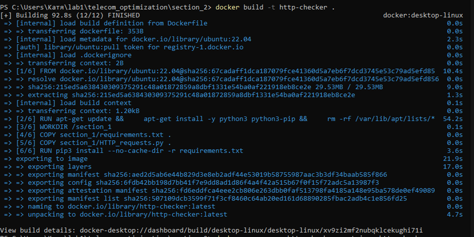
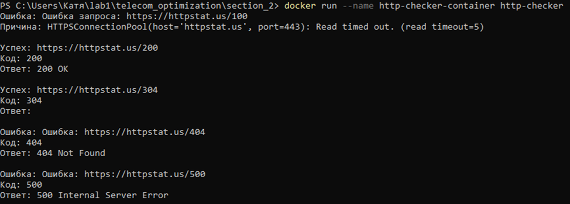
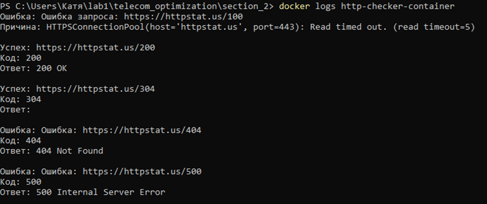
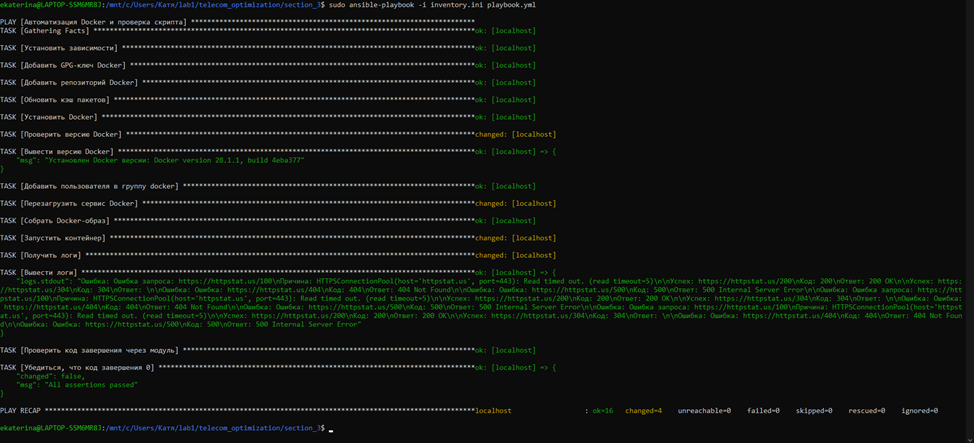

# telecom_optimization
Пошаговая автоматизация с использованием Python, Docker и Ansible

Section_1: В данной директории находится скрипт, который выполняет HTTP-запросов к https://httpstat.us с обработкой ответов.

Была использована библиотека `requests` для упрощения отправки HTTP-запросов и обработки ответов.
В консоль выводятся успешные ответы и ошибки.

Section_2: Создание Docker-образа на базе Ubuntu 22.04, запускающий скрипт из Раздела 1.

Файлы:
	section_2/Dockerfile — конфигурация образа.
	section_2/requirements.txt — зависимости Python.

Пример работы:

Docker создает образ на основе инструкций в Dockerfile.
Тег http-checker позволяет легко ссылаться на образ.

Section_3: Автоматизация установки Docker, сборки образа и проверки скрипта
Файлы:
	section_3/playbook.yml — Playbook Ansible.
	section_3/inventory.ini — инвентарь хостов.

1 Шаг: Установка Docker
Ansible подключается к хосту (локальному или удаленному).
Устанавливает зависимости, GPG-ключ, репозиторий и пакеты Docker.

2 Шаг: Настройка пользователя
Текущий пользователь (например, ekaterina) добавляется в группу docker

3 Шаг: Сборка Docker-образа
Ansible использует Dockerfile из section_2 для сборки образа.
Параметр pull: yes обновляет базовый образ, если требуется.

4 Шаг: Запуск контейнера
Контейнер запускается из образа http-request.
Параметр detach: yes запускает контейнер в фоновом режиме.

5 Шаг: Проверка логов
Выполняет команду docker logs на целевом хосте.
Результат выполнения команды сохраняется в переменную logs.

6 Шаг: Проверка кода завершения
Ansible проверяет статус контейнера.
Утверждение (assert) гарантирует, что код завершения равен 0 (успех).

Пример работы:
