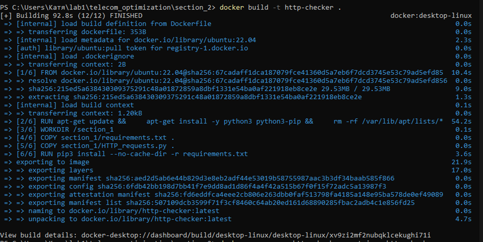
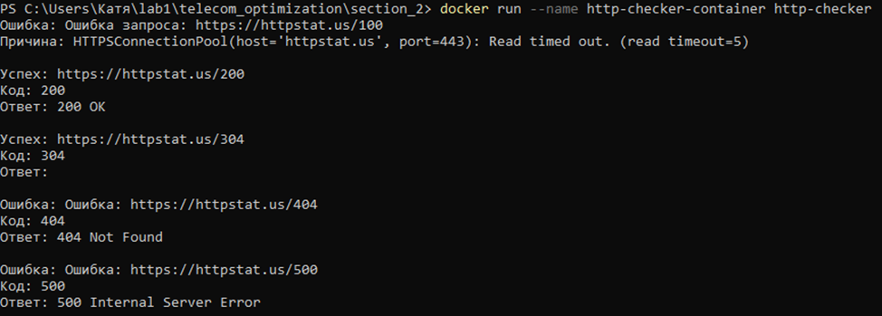
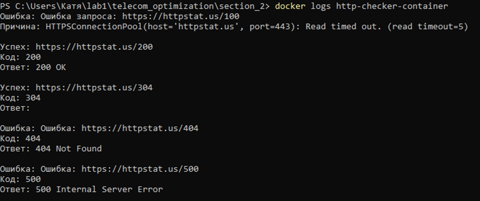
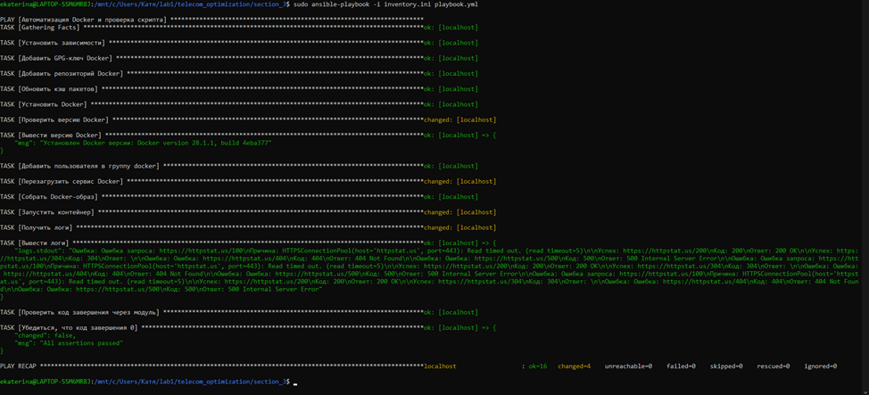

# telecom_optimization
Пошаговая автоматизация с использованием Python, Docker и Ansible

Section_1: В данной директории находится скрипт, который выполняет TTP-запросов к https://httpstat.us с обработкой ответов.

Section_2: Создание Docker-образа на базе Ubuntu 22.04, запускающий скрипт из Раздела 1.
Файлы:
•	section_2/Dockerfile — конфигурация образа.
•	section_2/requirements.txt — зависимости Python.
Пример работы:

Section_3: Автоматизация установки Docker, сборки образа и проверки скрипта
Файлы:
•	section_3/playbook.yml — Playbook Ansible.
•	section_3/inventory.ini — инвентарь хостов.
Пример работы:
